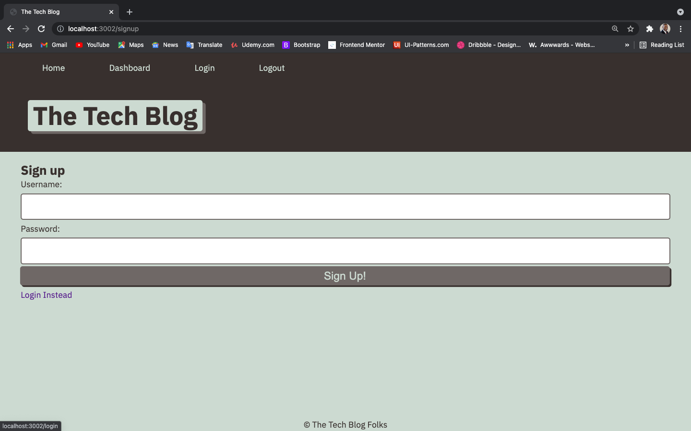
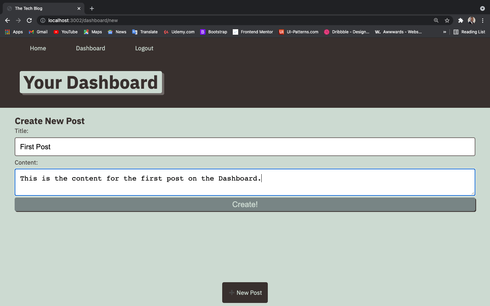
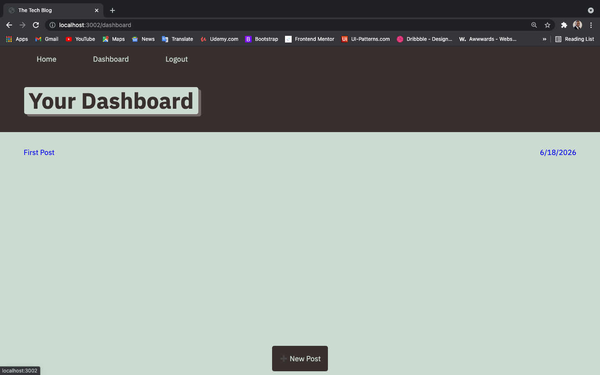
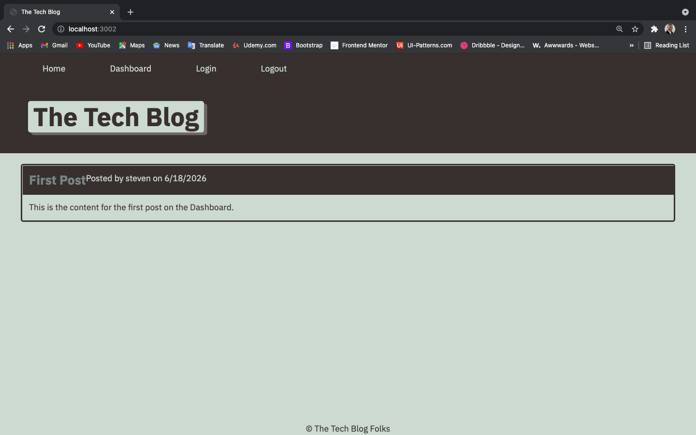

# Tech-Blog

* This Tech-Blog will allow a user to sign up, log in, and log out with a username and hidden password.
* On the dashboard, the user will be able to create a new blog post that will render onto the home page.

---

## User Story

* As a developer who writes about tech, I want a way to publish articles, blog posts, and my own personal thoughts online.

---

## Get Started

* Below you will see screen shots of how the web application will work.

* On the first screen you will click the login button, located at the top of the home page.

* Under the login button, you will see a link to sign up. Click this link if this is the first time you will be adding content onto the page. Otherwise, enter in your username and password.

* When you have signed in successfully, you can click on the Dashboard tab at the top of the page.
* You will now be on a page to create your first blog post. Click on the New Post button.

* You can now enter in your title and content for your first blog post.

* After you click the create button, you will see the title and date of your first post.
* If needed, you can click on the title of the post and edit or remove the post from your dashboard.

* When you have successfully created your first post, you will click on the home tab at the top of the page and you will see your first blog listed on the home page.

* Congratulations on creating your first blog post! 

---

## Note and Link

* This MVC app utilizes express-handlebars, sequelize, MySQL, JSON, Express.js, HTML, CSS, & JavaScript to allow you to create a blog post, dynamically to the client. This web application is deployed on the Heroku platform and stored on the Github.com platform.

* You can also reach the app using this link to Heroku: [Unique-Tech-Blog](https://unique-tech-blog.herokuapp.com/)